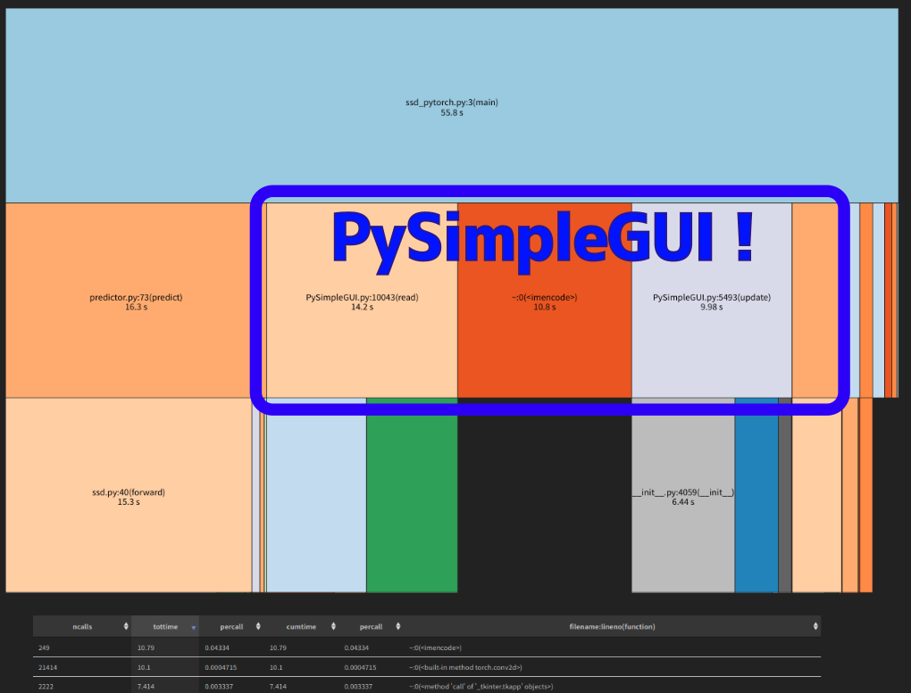

UbuntuのPython仮想環境venvでcv2.imshowが表示されない件（エラーログも表示されない）

# はじめに
UbuntuのPython仮想環境venvでcv2.imshowが表示されない件（エラーログも表示されない）について調べたので、そのメモです。
（タイトルは参考URLと同じにさせて頂きました。というのも、cv2.imshow関連で検索した場合、大抵`cv2.waitKey()`を書き忘れてる件ばかりがヒットするからです。このタイトルが一番しっくりきました。）

参考
https://www.hiro877.com/entry/opencv-not-function-imshow

以前からPythonの仮想環境中でopenCVを使うときに、cv2.imshowが表示されないことがありました。
その場合、pyenvでPythonのバージョンを変更すると表示されるようになる場合があり、しかしそれも再現性がなく困っていました。

仕方がないので、PySimpleGUIを使って画像を表示するようにしていました。

PySimpleGUIは非常に使い勝手が良いのですが、処理が重くなるのが難点です。



この図はSSD（Single Shot Multibox Detector）を実装し、`snakeviz`で可視化したときのものです。
全体の処理のうち、$ \frac{3}{4} $程がPySimpleGUIの処理に費やされています。
処理を軽くしようと努力してるのに、PySimpleGUIのせいで処理が重くなっているのは悲しいです。


ということで重い腰を上げ、cv2.imshowが表示されない問題を解決することにしました。

# 環境
```bash
Python 3.8.10 (default, May 26 2023, 14:05:08) 

$ inxi -SCGxx --filter
System:    Kernel: 5.15.0-78-generic x86_64 bits: 64 compiler: N/A Desktop: Gnome 3.36.9 wm: gnome-shell dm: GDM3 
           Distro: Ubuntu 20.04.6 LTS (Focal Fossa) 
CPU:       Topology: Quad Core model: AMD Ryzen 5 1400 bits: 64 type: MT MCP arch: Zen rev: 1 L2 cache: 2048 KiB 
           flags: avx avx2 lm nx pae sse sse2 sse3 sse4_1 sse4_2 sse4a ssse3 svm bogomips: 60797 
           Speed: 3800 MHz min/max: N/A Core speeds (MHz): 1: 3800 2: 3800 3: 3800 4: 3800 5: 3800 6: 3800 7: 3800 8: 3800 
Graphics:  Device-1: NVIDIA TU116 [GeForce GTX 1660 Ti] vendor: Micro-Star MSI driver: nvidia v: 525.85.12 bus ID: 08:00.0 
           chip ID: 10de:2182 
           Display: x11 server: X.Org 1.20.13 driver: fbdev,nouveau unloaded: modesetting,vesa compositor: gnome-shell 
           resolution: 2560x1440~60Hz 
           OpenGL: renderer: NVIDIA GeForce GTX 1660 Ti/PCIe/SSE2 v: 4.6.0 NVIDIA 525.85.12 direct render: Yes 
```

# 結論
- Python仮想環境から、opencv-pythonをアンインストール
- synapticにて、python3-opencvをインストール
- openCVのライブラリパスを取得し、sys.pathに追加

それぞれの手順を説明します。
1. Python仮想環境から、opencv-pythonをアンインストール
```bash
$ pip uninstall opencv-python
```
2. synapticにて、python3-opencvをインストール
```bash
$ sudo apt install python3-opencv
```
3. openCVのライブラリパスを取得し、sys.pathに追加
   1. openCVのライブラリパスを取得
   ```bash
   $ python3
   Python 3.8.10 (default, May 26 2023, 14:05:08) 
   [GCC 9.4.0] on linux
   Type "help", "copyright", "credits" or "license" for more information.
   >>> import cv2
   >>> print(cv2)
   <module 'cv2' from '/usr/lib/python3/dist-packages/cv2.cpython-38-x86_64-linux-gnu.so'>
   ```
    2. sys.pathに追加
   ```python
   import sys
   sys.path.append('/usr/lib/python3/dist-packages')

   import cv2
   ```

参考URLには「opencvのソースコードを取得してビルドする」という過程がありますが、その必要はありませんでした。


cv2.imshow()を使用する場合には、上記のようにsys.pathに追加すればよいようです。

以上です。ありがとうございました。